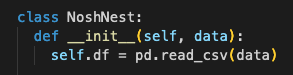
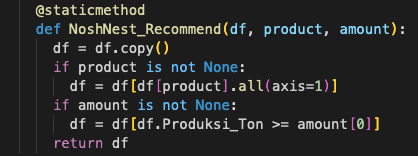
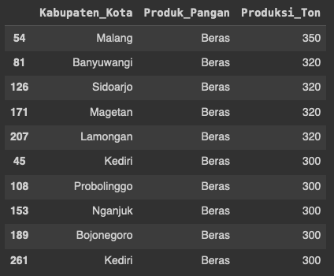

# NOSHNEST : Network Of Sustainable Harvesting (Demographic Filtering)
---
### Domain Project

> **The themes we chose in this capstone project are Food Accessibility, Agribusiness, and Food Security, Sustainable Living, Digital Government Transformation with the project title "NOSHNEST: Sustainable Harvesting Network”
**.

### Backgrounder

The world is currently faced with the complexity of a globally spanning food crisis. One of the main drivers of this instability is rising food prices, which are linked to a number of multifaceted factors. Food price fluctuations at the global level are triggered by extreme weather conditions that are detrimental to agricultural production, increased food demand from a growing world population, instability in currency exchange rates, and changes in international trade policies.
In this context, climate change is an aspect that further complicates food security. Natural disasters such as floods, droughts and storms, all of which are closely linked to climate change, can damage crop yields and significantly reduce food production. This phenomenon illustrates the interconnection between climate change and the vulnerability of the global food system.

In addition, dependence on certain types of food in some countries increases the risk of food crises. If the production of one type of food fails, this can have a significant impact on national and regional food security. This raises the urgent need to diversify food sources and promote more resilient and sustainable food security.
With these increasingly complex and globally linked dynamics, supporting food security is an urgent imperative. Collaborative efforts and holistic solutions are needed to address these challenges and build food systems that are resilient and empower people around the world.

The global food crisis is not only triggered by production and food security factors, but is also closely related to the problem of inefficient food distribution. Limited logistics infrastructure, especially in rural areas of developing countries, is a major obstacle in delivering food to end consumers. Long global supply chains increase the risk of disruptions and delays in distribution, especially in extreme weather conditions or global crises. Distribution imbalances between regions also create unequal access to food, where some regions may experience shortages while others may face surpluses. Food wastage and losses during distribution are a serious problem, which can occur due to inadequate logistics management, poor storage or inefficient distribution processes. In addition, crisis or conflict situations can exacerbate distribution uncertainties, limiting access to affected areas. Therefore, efforts to improve food distribution efficiency through technology, innovation and infrastructure improvements are crucial in addressing the global food crisis.

In Indonesia, the problem of inefficient food distribution is one of the factors that complicate the challenges of the food crisis. Despite the country's vast agricultural potential, limited logistics infrastructure in some regions, especially in rural areas, is often a major obstacle. Inaccessible transportation and suboptimal distribution channels can make it difficult to deliver food from producers to end consumers. In addition, distribution imbalances between regions in Indonesia create disparities in access to food. While some regions may face scarcity and difficulty getting supplies, other regions may have uneven surpluses. This not only impacts overall food availability, but also leads to uneven price fluctuations in different regions. To address these issues, serious efforts are needed to improve logistics infrastructure, utilize technology for supply chain management, and create more effective distribution policies. Increased involvement of the private sector, the application of information technology, and innovation in distribution management can help optimize food flows in Indonesia, thereby achieving the goal of more robust food security. By working together with local governments and current technology, problems related to food distribution can be controlled.


# Business Understanding
---
#### Problem Statements
Based on the above background, the following problems can be solved in this project:

- How to process data so that it can be used in creating a demographic filtering model that suits the needs of the model?
- How to provide recommendations for food barns that suit the needs of local residents?

#### Goals
- Perform processing properly so that it can be used in modeling.
- Create a recommendation system that suits user needs.

#### Solution Statements
Solutions that can be done to meet the objectives of this project include:
* For data processing, several techniques can be used, including:
    * checking whether there is empty data 
    * Counting the amount of data in the dataset.
* The method used in this project is Demographic Filtering. Demographic Filtering is a filtering method that utilizes information or user characteristics to provide recommendations or filter more appropriate content. In this case, this method utilizes information about the type of food needed/available and information about the amount of food data needed/available.
  * Advantages
        * Effective targeting
        By understanding the demographic characteristics of users, platforms or businesses can conduct more effective targeting in marketing campaigns or product promotions.
  * Disadvantages
        * Limitations in Capturing Individual Uniqueness
       This method tends to lack the ability to capture individual uniqueness and changes in preferences over time. Two people with the same demographic characteristics may have different preferences.

# Data Understanding
In this project we use dummy data, because it is difficult to find data on food needs in the Indonesian region. The dataset we use called data_lumbung.csv contains 12 columns and 342 rows. The explanation of the variables in this noshnest recommendation dataset is as follows:
- **Kabupaten_Kota**. This parameter is used as information on the location of food barns.
- **Produksi_Pangan**. This parameter is used to represent the type of food.
- **Produksi_Ton** This parameter is used to represent the amount of a food item.
- **beras** This parameter serves as a marker that the column is of the food type 'rice'.
- **cabai** This parameter serves as a marker that the column is of the food type 'chili'.
- **bawang_putih** This parameter serves as a marker that the column is of the food type 'garlic'.
- **bawang_merah** This parameter serves as a marker that the column is of the food type 'onion'.
- **lengkuas** This parameter serves as a marker that the column is of the food type 'galangal'.
- **jahe** This parameter serves as a marker that the column is of the food type 'ginger'.
- **kunyit** This parameter serves as a marker that the column is of the food type 'turmeric'.
- **singkong** This parameter serves as a marker that the column is of the food type 'cassava'.
- **kedelai** This parameter serves as a marker that the column is of the food type 'soy'.

we will use ```dataset.info()``` to check the column type in the dataset

.png)

# Modeling
---


* The NoshNest class has a constructor (__init__) that will read the CSV file using Pandas and store it as a df (DataFrame) attribute of the NoshNest object.


* The recommendation method is used to generate recommendations based on a product, a specified number, and returns the number of top recommendations.
* First, the DataFrame (df) object of the class is copied to ensure that no changes break the original data.
* The NoshNest_Recommend method is called to filter by product and quantity.
* The filtered DataFrame then retrieves certain columns (from "Kabupaten_Kota" to "Produksi_Ton").
* The results are sorted by the "Produksi_Ton" column in descending order, and only the top number is retrieved according to the top parameter.


* The static method NoshNest_Recommend is used to filter by product and quantity.
* The given data is copied first to avoid changes to the original data.
* If the given product (product) is not None, then filtering is done based on the product. Filtering is done on rows that have True value in the product column.* If the given amount is not None, then filtering is done based on the production amount (Produksi_Ton) which is greater than or equal to the given amount.


# Evaluation
---
In this phase we will try the model that has been made before 


* Create a recsys object from the NoshNest class.
* Uses a CSV file with the path '/content/data_lumbung.csv' as input data for the object.
* Calls the recommendation method of the recsys object.
* Provides the parameters:
    * product=['beras']: Filter recommendations only for the product 'rice'.
    * amount=(300,): Filter recommendations only for production quantities equal to or exceeding 300 tons.

after that the model will provide recommendation results in the form of granaries that provide rice-type foodstuffs with a minimum production of 300 tons.




